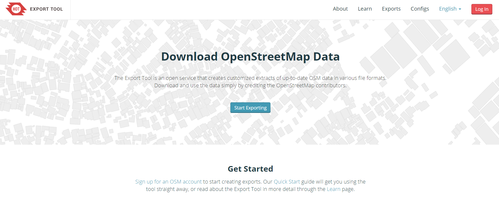
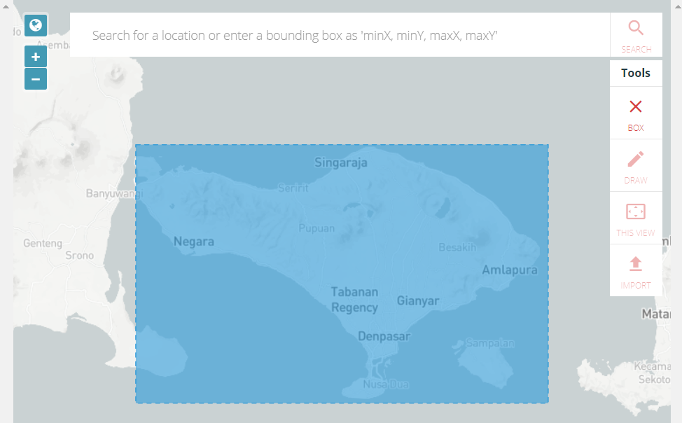

# **Download Data OSM dengan Menggunakan _Export Tool_**

**Tujuan Pembelajaran**

*   Memahami pengertian _Export Tool_
*   Mempraktikkan cara mendapatkan data OSM dengan _Export Tool_

Setelah Anda belajar bagaimana menambahkan dan mengedit data pada _OpenStreetMap_ (OSM), sekarang Anda akan mempelajari tentang bagaimana cara mendapatkan data _OpenStreetMap_ yang telah di-_upload_ ke server OSM. Data tersebut dapat digunakan untuk analisis data, kustomisasi simbologi data, membuat peta, dan lainnya sesuai kebutuhan Anda. 

### **I. Pengertian _Export Tool_**

_Export tool_ adalah sebuah layanan terbuka yang digunakan untuk men-_download_ data OSM terbaru yang memberikan kebebasan bagi pengguna untuk memilih data yang akan mereka _download _di area tertentu._ Export tool_ juga menyediakan pilihan format data spasial, seperti ESRI shapefiles (_.shapefile_), google KML (_.kml_), GeoPackage (_.gpkg_) dan MBTiles (_.mbtiles_). Anda dapat memilih wilayah yang diinginkan dan kategori data yang akan di-_download_ dengan menggunakan _Export Tool._ Cara men-_download_ data pada situs ini sangat mudah dan tidak ada persyaratan, hanya Anda diwajibkan untuk mendaftar dengan menggunakan akun _OpenStreetMap_ Anda dan mencantumkan sumber data untuk lisensi kredit pada produk yang Anda buat seperti **© OpenStreetMap contributors.**

### **II. Cara Menggunakan _Export Tool_**

*   Buka halaman situs Anda, dan ketikkan link berikut ini https://export.hotosm.org

Halaman muka Export Tool

*   Anda harus masuk menggunakan akun OSM dengan klik **_Login_** di sudut kanan atas. Apabila muncul _‘Authorize access to your account’_ klik **_Grant Access_**. Jika belum memiliki akun OSM, Anda dapat membuka pada modul **Memulai Menggunakan OSM**.
*   Sekarang Anda sudah berhasil masuk dengan menggunakan akun OSM, kemudian klik **_Start Exporting_** untuk memulai proses _download_ data OSM.
*   Akan muncul formulir isian dan peta seperti gambar di bawah ini, formulir isian harus  diisi dan Anda dapat memilih area yang diinginkan pada peta di sebelah kanan. 

Lembar kerja Export Tool

*   Ada beberapa cara untuk menggambarkan area yang akan dipilih
1. **_Box_** = Menggambar area dengan menggunakan kotak. Jika Anda ingin mengulang untuk pembuatan kotak klik tanda X pada kolom _Box_. 

  

Penentuan area dengan kotak

2. **_Draw_** = Menggambar area yang dipilih secara manual

  

Penentuan Area dengan Bentuk Manual

3. **_Import_** = Menggunakan poligon dalam format .geojson untuk memilih area yang akan di-_download_. Cara mendapatkan _file_ _.geojson_ dapat Anda lihat pada modul **Menggunakan GeoJSON**.

  

Penentuan area dengan berdasarkan admin

  
*   Jika sudah menyelesaikan formulir isian dan menentukan area yang akan di _download_, pilih menu **_Format_**. Pilih data spasial yang Anda inginkan, misalnya _shapefile_

  

Format data spasial

*   Selanjutnya klik Menu **Data**, pada bagian ini halaman yang akan muncul akan menyesuaikan pemilihan tipe data spasial yang Anda pilih sebelumnya pada **_Menu Format_**. Pada bagian **_Tag Tree_**, menunjukkan informasi objek yang sesuai dengan presets OSM secara global. Anda harus memberikan tanda centang untuk data OSM yang akan di-_download_ sesuai dengan kebutuhan data yang diinginkan. Sebagai contoh, jika kita akan men-_download_ data bangunan dan jalan, berikan tanda centang pada **_Buildings dan Transportation > Roads_**

  

Pilihan Objek di Export Tool

*   Klik Menu **_Summary_**, Anda harus memilih apakah _file_ ekspor ini akan dipublikasikan kepada umum atau hanya ada pada akun Anda. Kemudian klik **_Create Export_** untuk memulai proses _export_ data OSM.

  

Menu Summary

*   Tunggu beberapa saat sampai proses selesai. Jika _file export_ Anda telah selesai, _Export Tool_ akan memberikan pemberitahuan melalui email, atau Anda dapat melihat hasilnya di Menu **_Exports_**

  

Menu Exports

*   Jika proses sudah selesai akan muncul kotak dialog seperti di bawah ini, klik **nama file.shp.zip** untuk menyimpan hasil ekspor data OSM di direktori laptop/komputer Anda.

  

Proses Export Tool Selesai

**RINGKASAN**

Anda telah mengetahui bagaimana cara men-_download_ data OSM dengan menggunakan _Export Tool_. Data yang telah Anda _download_ dapat diolah dengan perangkat lunak sistem informasi geografis yang salah satu contohnya perangkat lunak yang _Open Source_ yaitu QGIS ([www.qgis.org](http://www.qgis.org)). Anda dapat memanfaatkan data tersebut untuk perhitungan kuantitas data OSM hasil dari pemetaan untuk membuat analisis data OSM.
