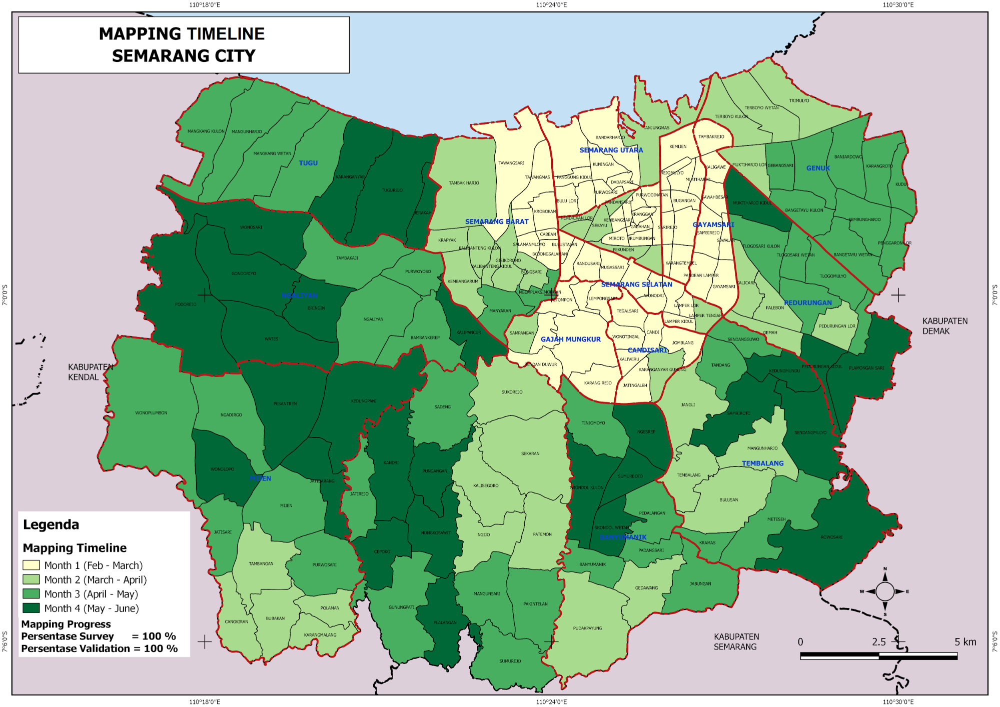
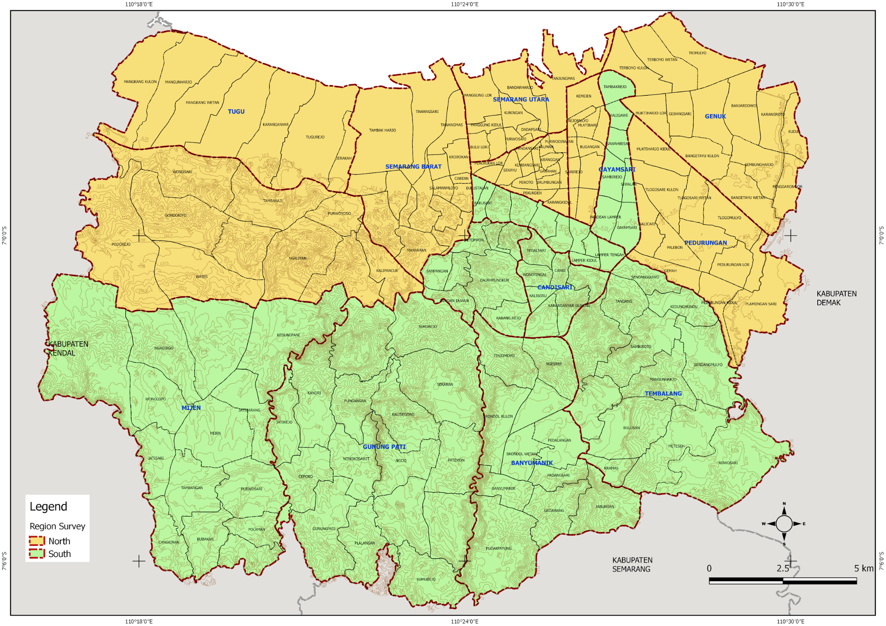
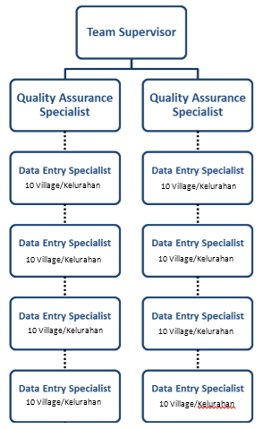

# **Metodologi Kerangka Kerja Pemetaan PDC InAWARE**

  **Tujuan Pembelajaran:**

*   Memahami cara membuat kerangka kegiatan pemetaan
*   Memahami cara pembagian arsip untuk masing-masing kelompok survei
*   Memahami cara pembagian area survei berdasarkan batas administrasi
*   Mengetahui cara pembagian kelompok yang efektif 

Perencanaan proyek pemetaan memerlukan metodologi survei yang tepat dan efisien untuk mencapai target dan tujuan pemetaan. Indikator-indikator yang perlu diperhatikan dalam pembuatan metodologi survei meliputi: luas wilayah survei, jumlah tim pemetaan, jumlah objek yang dikumpulkan, dan pendanaan proyek. Jika luas wilayah semakin besar dan jumlah objek yang dikumpulkan semakin banyak, maka pendanaan proyek juga semakin besar. 

Pada proyek pemetaan survei lapang akan dilaksanakan oleh tim pemetaan yang dibagi menjadi 3 (tiga) peran, yaitu :
*   _Mapping Supervisor_ = mengatur dan mengawasi jalannya proyek pemetaan, mempersiapkan keperluan pemetaan, membuat laporan hasil pemetaan dan memeriksa kualitas dan kuantitas data yang telah divalidasi oleh _Quality Assurance_.
*   _Quality Assurance_= menjamin kuantitas dan kualitas data yang dihasilkan oleh _data entry_ dan mengawasi _data entry_ dalam melakukan survei lapangan.
*   _Data Entry_ = melaksanakan survei lapangan dan memasukkan data lapangan ke dalam OSM beserta digitasi bangunan dan jalan.

### **I. Pembuatan Kerangka Kerja**

Perencanaan pemetaan memerlukan suatu kerangka kerja yang disesuaikan dengan indikator-indikator pemetaan yang telah disebutkan sebelumnya. Kerangka kerja tersebut dapat dijadikan acuan dalam pelaksanaan proyek pemetaan yang akan dimonitor oleh _Mapping Supervisor_ dan _Quality Assurance_. Kerangka kerja secara garis besar terdiri dari:
*   Persiapan proyek pemetaan
*   Penentuan jumlah tim _data entry_ dan tim _quality assurance_
*   Pelaksanaan pelatihan OSM untuk tim pemetaan
*   Proses pemetaan dan kegiatan mapathon
*   Pelaksanaan pelatihan QGIS untuk tim pemetaan
*   Pembuatan peta akhir

Sebagai contoh, dibawah ini merupakan kerangka kerja yang disusun untuk pemetaan di Kota Semarang tahun 2018 yang memiliki luas wilayah 373,8 km2 dengan jumlah _data entry_ 16 orang dan jumlah _quality assurance_ 4 orang. Infrastruktur yang dikumpulkan berjumlah 58 kategori objek meliputi jaringan jalan, sungai, tanggul dan fasilitas umum. Semua tahapan-tahapan pemetaan dilakukan selama 6 bulan.

#### **a. Pelatihan _OpenStreetMap_ dan QGIS untuk tim Pemetaan**

Pelatihan ini dilakukan untuk memberikan pemahaman terhadap metode pemetaan, penggunaan alat-alat survei lapangan, dan pembuatan peta cetak hasil survei lapang. Berikut ini pelatihan yang dapat Anda persiapkan sebelum pemetaan berlangsung :

*   Pelatihan _OpenStreetMap_ untuk _Data Entry_ dan _Quality Assurance_

Pelatihan dilakukan selama 3 hari, bertujuan untuk menggunakan alat-alat survei lapangan dan memasukkan hasil data survei ke dalam OpenStreetMap. Materi pelatihan yang diberikan, sebagai berikut: 

1. Memulai OpenStreetMap
2. Pengoperasian JOSM
3. Penggunaan Alat-Alat Survei (OpenMapKit, ODK Collect, OSMTracker, dan GPS)
4. Praktik Survei Lapang
5. Penggunaan Tasking Manager
6. Memasukkan Hasil Survei ke dalam OSM dengan menggunakan JOSM
7. Download Data OSM dengan Export Tool

*   Pelatihan Validasi Data untuk _Quality Assurance_

Pelatihan dilakukan selama 2 hari,  bertujuan untuk melakukan validasi data yang sudah dimasukkan oleh_ data entry_ ke dalam _OpenStreetMap_. Materi pelatihan yang diberikan, sebagai berikut: 

1. Validasi Data OSM menggunakan JOSM
2. Validasi Data OSM menggunakan Tasking Manager
3. Membuat Batas Administrasi dengan Relasi

*   Pelatihan QGIS untuk _Data Entry_ dan _Quality Assurance_

Pelatihan dilakukan selama 1 hari, bertujuan untuk membuat peta hasil survei lapang yang telah divalidasi oleh _Quality Assurance_ dan _Mapping Supervisor_. Materi pelatihan yang diberikan, sebagai berikut: 

1. Download dan Install QGIS
2. Persiapan data 
3. Analisis Vektor
4. Pembuatan peta dengan Map Composer

#### **b. Persiapan Mapathon**

Mapathon adalah pemetaan yang dilakukan secara bersama-sama secara partisipatif dengan menggunakan _tasking manager_. Anda dapat bekerja sama dengan pihak universitas untuk membantu memetakan bangunan dan jalan di wilayah pemetaan Anda. Hal ini sangat efektif untuk membantu pemetaan sehingga data entry dapat berfokus pada survei lapangan dan mempersingkat durasi pemetaan. Juga dapat menjalin kerjasama guna keberlanjutan data _OpenStreetMap_ di wilayah tersebut. Kegiatan mapathon dapat dilakukan selama 3 hari, dengan kegiatan di hari pertama diisi dengan pelatihan, kemudian hari kedua dan ketiga diisi dengan kegiatan pemetaan.

### **II. Pembuatan _Timeline_ Survei Pemetaan**

_Timeline_ survei pemetaan berbeda dengan kerangka kerja yang sebelumnya telah dibahas, pada bagian ini akan ditekankan bagaimana Anda dapat mengatur dan mengawasi pelaksanaan survei lapangan. Secara garis besar _timeline_ pemetaan terbagi menjadi tiga bagian, yaitu : 

#### 1. **Sebelum Survei Pemetaan**

Pada tahapan ini, kegiatan yang dilakukan akan berfokus pada persiapan peralatan survei. Peralatan survei lapangan terdiri dari GPS, _smartphone_ dan peta cetak. Semua peralatan itu harus dipersiapkan sebelum survei pemetaan dilaksanakan oleh _data entry._ Pada _smartphone_ akan dipasang aplikasi _ODK Collect, OpenMapKit (OMK)_, dan _OSMTracker_, dimana aplikasi OMK membutuhkan dua jenis data yang harus dipersiapkan yaitu batas administrasi dalam format *.osm* dan citra satelit dalam format _.mbtiles_. Peran _mapping supervisor_ sangat dominan di dalam bagian sebelum survei pemetaan, dimana mereka harus mempersiapkan peralatan yang diperlukan dalam pemetaan. Persiapan survei pemetaan terdiri dari:

*   Membuat MBTiles untuk citra satelit
*   Membuat peta survei berdasarkan batas administrasi
*   Membuat panduan survei pemetaan

     Contoh Tabel _Timeline_ Pemetaan Tahap Sebelum Survei

<table>
  <tr>
   <td>
<strong>NO</strong>
   </td>
   <td><strong>Estimasi Waktu / Tahap</strong>
   </td>
   <td><strong>Tim <em>Data Entry</em></strong>
   </td>
   <td rowspan="2" ><strong>KECAMATAN</strong>
   </td>
   <td><strong>Jml.</strong>

<strong>KEL</strong>
   </td>
   <td rowspan="2" ><strong>KELURAHAN</strong>
   </td>
   <td rowspan="2" ><strong>Jml. RW</strong>
   </td>
   <td colspan="3" ><strong>SEBELUM-SURVEI</strong>
   </td>
  </tr>
  <tr>
   <td>
   </td>
   <td>
   </td>
   <td>
   </td>
   <td>
   </td>
   <td><strong>mbtiles</strong>
   </td>
   <td><strong>PETA KEL (satelit)</strong>
   </td>
   <td><strong>PETA KEL (OSM)</strong>
   </td>
  </tr>
  <tr>
   <td>1
   </td>
   <td>Feb - Mar
   </td>
   <td>A
   </td>
   <td><a href="https://tasks.hotosm.org/project/4045">CANDISARI</a>
   </td>
   <td>7
   </td>
   <td>CANDI
   </td>
   <td>11
   </td>
   <td>v
   </td>
   <td>v
   </td>
   <td>v
   </td>
  </tr>
  <tr>
   <td>
   </td>
   <td>
   </td>
   <td>
   </td>
   <td>
   </td>
   <td>
   </td>
   <td>JATINGALEH
   </td>
   <td>10
   </td>
   <td>v
   </td>
   <td>v
   </td>
   <td>v
   </td>
  </tr>
  <tr>
   <td>
   </td>
   <td>
   </td>
   <td>
   </td>
   <td>100% Mapped
   </td>
   <td>
   </td>
   <td>JOMBLANG
   </td>
   <td>15
   </td>
   <td>v
   </td>
   <td>v
   </td>
   <td>v
   </td>
  </tr>
  <tr>
   <td>
   </td>
   <td>
   </td>
   <td>
   </td>
   <td>100% Validated
   </td>
   <td>
   </td>
   <td>KALIWIRU
   </td>
   <td>4
   </td>
   <td>v
   </td>
   <td>v
   </td>
   <td>v
   </td>
  </tr>
  <tr>
   <td>
   </td>
   <td>
   </td>
   <td>
   </td>
   <td>
   </td>
   <td>
   </td>
   <td>KARANGANYAR GUNUNG
   </td>
   <td>6
   </td>
   <td>v
   </td>
   <td>v
   </td>
   <td>v
   </td>
  </tr>
  <tr>
   <td>
   </td>
   <td>
   </td>
   <td>
   </td>
   <td>
   </td>
   <td>
   </td>
   <td>TEGALSARI
   </td>
   <td>13
   </td>
   <td>v
   </td>
   <td>v
   </td>
   <td>v
   </td>
  </tr>
  <tr>
   <td>
   </td>
   <td>
   </td>
   <td>
   </td>
   <td>
   </td>
   <td>
   </td>
   <td>WONOTINGAL
   </td>
   <td>6
   </td>
   <td>v
   </td>
   <td>v
   </td>
   <td>v
   </td>
  </tr>
</table>

_*Pengisian dilakukan oleh Mapping Supervisor_

**b. Survei Pemetaan**

Pada saat proses survei pemetaan, masing-masing tim memiliki peran agar survei pemetaan dapat terlaksana dengan baik, yaitu:
*   _Data Entry_ = mempersiapkan peralatan survei pada _smartphone_, melaksanakan survei, memasukkan data survei dan meng-_upload_ ke dalam OSM, digitasi bangunan dan jalan dengan menggunakan JOSM.
*   _Quality Assurance_ = memastikan dan mengawasi kualitas data yang telah di-_upload_ oleh _data entry_, memastikan dan mengawasi pelaksanaan survei yang dilakukan oleh _data entry_ di lapangan, serta mengatur strategi kegiatan survei lapangan bersama _data entry._
*   _Mapping Supervisor_ = memastikan kualitas dan kuantitas data serta memantau pelaksanaan survei yang disesuaikan dengan _timeline_ yang telah ditetapkan.

    Contoh Tabel _Timeline_ Pemetaan Tahap Survei Pemetaan

<table>
  <tr>
   <td colspan="2" >
<strong>PERSIAPAN HP</strong>
   </td>
   <td colspan="5" ><strong>SURVEI</strong>
   </td>
   <td colspan="5" ><strong>INPUT</strong>
   </td>
   <td rowspan="2" ><strong>Tanggal Validasi Infrastruktur</strong>
   </td>
  </tr>
  <tr>
   <td><strong>memasukkan mbtiles</strong>
   </td>
   <td><strong>clear file manager</strong>
   </td>
   <td><strong>Tanggal Survei</strong>
   </td>
   <td><strong>Tanggal Mendapat Batas RW</strong>
   </td>
   <td><strong>Infrastruktur</strong>
   </td>
   <td><strong>Lokasi Pengungsian</strong>
   </td>
   <td><strong>Jalur Evakuasi</strong>
   </td>
   <td><strong>Upload track</strong>
   </td>
   <td><strong>Kirim form ke OMK Server</strong>
   </td>
   <td><strong>Infrastruktur</strong>
   </td>
   <td><strong>RW</strong>
   </td>
   <td><strong>Jalur</strong>

<strong>Evakuasi</strong>

<strong>dan LP</strong>
   </td>
  </tr>
  <tr>
   <td>v
   </td>
   <td>v
   </td>
   <td>1,5-6 Mar 18
   </td>
   <td>1 Mar 18
   </td>
   <td>v
   </td>
   <td>Ada
   </td>
   <td>Tidak Ada
   </td>
   <td>v
   </td>
   <td>v
   </td>
   <td>v
   </td>
   <td>v
   </td>
   <td>v
   </td>
   <td>26 Mar 18
   </td>
  </tr>
  <tr>
   <td>v
   </td>
   <td>v
   </td>
   <td>12 Feb 18
   </td>
   <td>12 Feb 18
   </td>
   <td>v
   </td>
   <td>Tidak Ada
   </td>
   <td>Tidak Ada
   </td>
   <td>v
   </td>
   <td>v
   </td>
   <td>v
   </td>
   <td>v
   </td>
   <td>Tidak ada
   </td>
   <td>14,19 Feb 18
   </td>
  </tr>
  <tr>
   <td>v
   </td>
   <td>v
   </td>
   <td>8,12-14 Mar 18
   </td>
   <td>12 Mar 18
   </td>
   <td>v
   </td>
   <td>Ada
   </td>
   <td>Tidak Ada
   </td>
   <td>v
   </td>
   <td>v
   </td>
   <td>v
   </td>
   <td>v
   </td>
   <td>v
   </td>
   <td>27-28 Mar 18
   </td>
  </tr>
  <tr>
   <td>v
   </td>
   <td>v
   </td>
   <td>15 Feb 18
   </td>
   <td>15 Feb 18
   </td>
   <td>v
   </td>
   <td>Tidak Ada
   </td>
   <td>Tidak Ada
   </td>
   <td>v
   </td>
   <td>v
   </td>
   <td>v
   </td>
   <td>v
   </td>
   <td>Tidak Ada
   </td>
   <td>23 Feb 18
   </td>
  </tr>
  <tr>
   <td>v
   </td>
   <td>v
   </td>
   <td>19,21 Mar, 4 Apr 18
   </td>
   <td>12 Mar 18
   </td>
   <td>v
   </td>
   <td>Tidak Ada
   </td>
   <td>Tidak Ada
   </td>
   <td>v
   </td>
   <td>v
   </td>
   <td>v
   </td>
   <td>v
   </td>
   <td>Tidak Ada
   </td>
   <td>2,5 Apr 18
   </td>
  </tr>
  <tr>
   <td>v
   </td>
   <td>v
   </td>
   <td>26-27 Feb 18
   </td>
   <td>23 Feb 18
   </td>
   <td>v
   </td>
   <td>TIdak Ada
   </td>
   <td>TIdak Ada
   </td>
   <td>v
   </td>
   <td>v
   </td>
   <td>v
   </td>
   <td>v
   </td>
   <td>Tidak Ada
   </td>
   <td>7 Mar 18
   </td>
  </tr>
  <tr>
   <td>v
   </td>
   <td>v
   </td>
   <td>20-21 Feb 18
   </td>
   <td>20 Feb 18
   </td>
   <td>v
   </td>
   <td>TIdak Ada
   </td>
   <td>TIdak Ada
   </td>
   <td>v
   </td>
   <td>v
   </td>
   <td>v
   </td>
   <td>v
   </td>
   <td>Tidak Ada
   </td>
   <td>26 Feb 18
   </td>
  </tr>
</table>

#### **c. Setelah Survei Pemetaan**

Jika seluruh proses pemetaan sudah selesai, maka _mapping supervisor_ dan _quality assurance_ harus memastikan keseluruhan data yang dimasukkan ke dalam OSM memiliki kualitas yang baik dan bebas dari kesalahan. Langkah selanjutnya adalah pembuatan peta akhir yang diberikan untuk pemerintah lokal yang terlibat dalam proses survei lapangan.

Contoh Tabel _Timeline_ Pemetaan Tahap Setelah Survei 

<table>
  <tr>
   <td rowspan="2" ><strong>Validasi Batas Administrasi</strong>
   </td>
   <td rowspan="2" ><strong>Kuantitas Data </strong>

<strong>Rekap Objek Hasil Validasi</strong>
   </td>
   <td rowspan="2" ><strong>Kualitas  Data</strong>

<strong>Rekap Objek Hasil Validasi</strong>
   </td>
   <td rowspan="2" ><strong>Peta Cetak dan Distribusi</strong>
   </td>
  </tr>
  <tr>
  </tr>
  <tr>
   <td>v
   </td>
   <td>v
   </td>
   <td>v
   </td>
   <td>v
   </td>
  </tr>
  <tr>
   <td>v
   </td>
   <td>v
   </td>
   <td>v
   </td>
   <td>v
   </td>
  </tr>
  <tr>
   <td>v
   </td>
   <td>v
   </td>
   <td>v
   </td>
   <td>v
   </td>
  </tr>
  <tr>
   <td>v
   </td>
   <td>v
   </td>
   <td>v
   </td>
   <td>v
   </td>
  </tr>
  <tr>
   <td>v
   </td>
   <td>v
   </td>
   <td>v
   </td>
   <td>v
   </td>
  </tr>
  <tr>
   <td>v
   </td>
   <td>v
   </td>
   <td>v
   </td>
   <td>v
   </td>
  </tr>
  <tr>
   <td>v
   </td>
   <td>v
   </td>
   <td>v
   </td>
   <td>v
   </td>
  </tr>
</table>

Contoh kelengkapan _timeline_ pemetaan dapat diunduh di tautan berikut [https://tinyurl.com/timeline-pemetaan](https://tinyurl.com/timeline-pemetaan)

### **III. Pembuatan dan Pengaturan Folder Kerangka Kerja Pemetaan**

Dalam mengatur dan memantau kerangka kerja pemetaan, Anda memerlukan suatu tempat penyimpanan data yang terorganisasi dan mempermudah pendistribusian ke semua pihak yang terlibat dalam proyek pemetaan. Hasil pemetaan terdiri dari data spasial yang akan di-_upload_ ke dalam _OpenStreetMap_. Data tersebut akan di _download_ kembali dan disimpan dalam beberapa format data spasial yang disesuaikan dengan _output_ pemetaan.  

_Database_ dapat disimpan dalam bentuk _file_ digital yang bersifat _online_, agar mudah pendistribusian kepada _data entry_ dan _quality assurance_. Nantinya data tersebut akan dipantau  juga oleh _mapping supervisor_, sebagai pengecekan dan perhitungan untuk kalkulasi data. 

Tempat penyimpanan yang mudah dari segi penggunaan dan pengaplikasian yaitu _google drive_. _Google drive_ dapat menyimpan berbagai jenis data dan dapat dibagikan kepada semua orang. _Mapping supervisor_ dapat membuat suatu folder didalam _google drive_ yang terdiri dari:

Contoh Tabel Folder Proyek Pemetaan

<table>
  <tr>
   <td><strong>Nama Folder</strong>
   </td>
   <td><strong>Deskripsi</strong>
   </td>
  </tr>
  <tr>
   <td><em>Timeline</em>
   </td>
   <td>Kerangka kerja dan <em>timeline </em>survei pemetaan
   </td>
  </tr>
  <tr>
   <td><em>Training</em>
   </td>
   <td>Agenda pelatihan dan materi pelatihan
   </td>
  </tr>
  <tr>
   <td>Tim Pemetaan
   </td>
   <td>Daftar nama tim pemetaan (<em>data entry, quality assurance, dan mapping supervisor</em>)
   </td>
  </tr>
  <tr>
   <td>Data Survei
   </td>
   <td>Hasil pemetaan OpenMapKit (OMK) dan ODK Collect, batas administrasi, tempat pengungsian, jalur evakuasi, dll.
   </td>
  </tr>
  <tr>
   <td>Dokumentasi Survei
   </td>
   <td>Foto dan video selama kegiatan survei
   </td>
  </tr>
  <tr>
   <td>Peta
   </td>
   <td>Peta survei, <em>fieldpapers</em>, dan peta hasil
   </td>
  </tr>
  <tr>
   <td>Laporan
   </td>
   <td>Laporan perbulan yang dibuat oleh<em> quality assurance</em> dan <em>mapping supervisor </em>
   </td>
  </tr>
  <tr>
   <td>Kualitas Data
   </td>
   <td>Perhitungan kualitas data yang dihasilkan sebelum dan sesudah pemetaaan
   </td>
  </tr>
  <tr>
   <td>Kuantitas Data
   </td>
   <td>Perhitungan kuantitas data yang dihasilkan sebelum dan sesudah pemetaaan
   </td>
  </tr>
  <tr>
   <td>OMK <em>Equipment</em>
   </td>
   <td>Peralatan survei yang dibutuhkan oleh OMK seperti MBTiles
   </td>
  </tr>
</table>

Data-data digital harus di-_upload_ ke dalam folder tersebut seiring dengan berjalannya proyek pemetaan, agar data tersebut dapat di-_backup_ dengan baik dan tidak ada data yang hilang atau rusak.

 
### **IV. Pembagian Wilayah Survei Berdasarkan Batas Administrasi**

Luas wilayah, topografi, dan penggunaan lahan suatu wilayah sangat menentukan pembagian wilayah dan durasi pemetaan dalam survei. Pembagian wilayah dapat dibagi berdasarkan unit terkecil dari wilayah administrasi misalnya tingkat kelurahan. Jika Anda telah memiliki batas-batas kelurahan yang ada di dalam wilayah tersebut, maka Anda dapat memperhatikan aspek selanjutnya yaitu topografi dan penggunaan lahan. 

Misalnya pemetaan yang dilakukan di Kota Semarang memiliki luas wilayah 373,8 km2 yang terdiri dari 16 kecamatan dan 177 kelurahan. Topografi yang dimiliki Kota Semarang mempengaruhi karakteristik wilayahnya yang terbagi menjadi dua bagian yaitu wilayah pesisir (Semarang Bawah) dan wilayah perbukitan (Semarang Atas). Wilayah semarang bawah merupakan pusat aktivitas perekonomian, pemerintahan, dan permukiman. Sedangkan wilayah Semarang Atas merupakan perkembangan permukiman, fasilitas pendidikan, dan perkebunan. Oleh karena itu, Semarang bawah memiliki infrastruktur yang lebih padat dibandingkan dengan Semarang atas. 

Analisis ketinggian wilayah dapat mempengaruhi dalam hal rute perjalanan saat _data entry_ melaksanakan survei lapangan karena masing-masing wilayah padat pemukiman dan wilayah perbukitan memiliki hambatan tersendiri. Faktor lainnya yang harus diperhatikan yaitu kondisi cuaca saat pemetaan dilakukan, musim hujan dapat menjadi penghambat survei lapangan, terutama di wilayah yang rawan banjir. Jika curah hujan tinggi, Anda dapat mengarahkan _data entry_ ke lokasi yang tidak rawan banjir terlebih dahulu.

Setelah Anda mengetahui faktor-faktor yang menentukan durasi pemetaan, Anda dapat membagi wilayah survei berdasarkan batas administrasi kecamatan atau kelurahan. Misalnya satu kecamatan dapat diselesaikan dalam waktu satu bulan dan dikerjakan oleh satu tim kelompok survei yang terdiri dari beberapa orang _data entry_. Berdasarkan analisis tersebut, pemetaan di Kota Semarang dapat diselesaikan dalam waktu 4 bulan dengan melibatkan 16 orang _data entry_.   

Tahapan pembagian wilayah untuk bulan pertama dapat dilakukan dengan area yang dekat dengan _basecamp_/kantor agar memudahkan dalam hal koordinasi penggunaan alat yang dilakukan oleh _data entry._ Jika _data entry_ menemukan masalah di lapangan, maka mereka dapat kembali ke kantor dengan jarak yang tidak terlalu jauh dari lokasi survei.

   
Pada peta perencanaan pemetaan Kota Semarang dibawah ini, dibagi menjadi dua bagian berdasarkan karakteristik wilayah, sehingga diperlukan dua orang _mapping supervisor_ untuk mengatur dan memantau kegiatan pemetaan.

Contoh Tabel _Timeline_ Pembagian Wilayah

<table>
  <tr>
   <td><strong><em>Timeline</em></strong>
   </td>
   <td><strong>Wilayah Kecamatan</strong>
   </td>
   <td><strong><em>Mapping Supervisor </em>Utara - Semarang Bawah</strong>
   </td>
   <td><strong><em>Mapping Supervisor</em> Selatan - </strong>

<strong>Semarang Atas</strong>
   </td>
  </tr>
  <tr>
   <td>Tahap 1 (1,5 Bulan)
   </td>
   <td>Kecamatan yang dekat dengan kantor/<em>basecamp</em>.  Misalnya berjarak kurang dari 20 km dari kantor
   </td>
   <td>Kec Semarang Barat

Kec Semarang Tengah

Kec Semarang Timur

Kec Semarang Utara
   </td>
   <td>Kec Candisari

Kec Semarang Selatan

Kec Gayamsari

Kec Gajah Mungkur
   </td>
  </tr>
  <tr>
   <td>Tahap 2 (2,5 Bulan)
   </td>
   <td>Kecamatan lebih dari 20 km 
   </td>
   <td>Kec Ngaliyan

Kec Pedurungan

Kec Tugu

Kec Genuk
   </td>
   <td>Kec Banyumanik

Kec Tembalang

Kec Mijen

Kec Gunung Pati
   </td>
  </tr>
</table>

### **V. Pembagian Kelompok Tim Pemetaan**

Aspek pembagian wilayah sangat menentukan dalam pembagian kelompok survei, terutama untuk pendistribusian _data entry_. Anda dapat memilih berdasarkan orang-orang yang sudah mengenal wilayah tersebut. Untuk mendapatkan informasi tersebut, Anda dapat mencantumkan pertanyaan wilayah mana saja yang mereka pahami pada saat tahap penerimaan _data entry_ yang baru. Berdasarkan pembagian wilayah yang sudah dijelaskan sebelumnya, maka tim pemetaan memiliki bagan sebagai berikut:

Tabel Pembagian Kelompok Berdasarkan Wilayah Survei

<table>
  <tr>
   <td><strong><em>Mapping Supervisor</em></strong>
   </td>
   <td><strong><em>Quality Assurance</em></strong>
   </td>
   <td><strong><em> data entry</em></strong>
   </td>
   <td><strong>Kecamatan</strong>
   </td>
   <td><strong>Jml Kelurahan</strong>
   </td>
   <td><strong>Total</strong>
   </td>
  </tr>
  <tr>
   <td rowspan="8" >MSpv 1
   </td>
   <td>QA1
   </td>
   <td rowspan="2" >DE1

DE2
   </td>
   <td>Candi Sari
   </td>
   <td>7
   </td>
   <td>21
   </td>
  </tr>
  <tr>
   <td>
   </td>
   <td>Mijen
   </td>
   <td>14
   </td>
   <td>
   </td>
  </tr>
  <tr>
   <td>
   </td>
   <td rowspan="2" >DE3

DE4
   </td>
   <td>Semarang Selatan
   </td>
   <td>10
   </td>
   <td>21
   </td>
  </tr>
  <tr>
   <td>
   </td>
   <td>Banyumanik
   </td>
   <td>11
   </td>
   <td>
   </td>
  </tr>
  <tr>
   <td>QA2
   </td>
   <td rowspan="2" >DE5

DE6
   </td>
   <td>Gayam Sari
   </td>
   <td>7
   </td>
   <td>23
   </td>
  </tr>
  <tr>
   <td>
   </td>
   <td>Gunung Pati
   </td>
   <td>16
   </td>
   <td>
   </td>
  </tr>
  <tr>
   <td>
   </td>
   <td rowspan="2" >DE7

DE8
   </td>
   <td>Gajah Mungkur
   </td>
   <td>8
   </td>
   <td>20
   </td>
  </tr>
  <tr>
   <td>
   </td>
   <td>Tembalang
   </td>
   <td>12
   </td>
   <td>
   </td>
  </tr>
  <tr>
   <td rowspan="8" >MSpv 2
   </td>
   <td>QA2
   </td>
   <td rowspan="2" >DE9

DE10
   </td>
   <td>Semarang Barat
   </td>
   <td>16
   </td>
   <td>23
   </td>
  </tr>
  <tr>
   <td>
   </td>
   <td>Tugu
   </td>
   <td>7
   </td>
   <td>
   </td>
  </tr>
  <tr>
   <td>
   </td>
   <td rowspan="2" >DE11

DE12
   </td>
   <td>Semarang Tengah
   </td>
   <td>15
   </td>
   <td>25
   </td>
  </tr>
  <tr>
   <td>
   </td>
   <td>Ngaliyan
   </td>
   <td>10
   </td>
   <td>
   </td>
  </tr>
  <tr>
   <td>QA2
   </td>
   <td rowspan="2" >DE13

DE14
   </td>
   <td>Semarang Timur
   </td>
   <td>10
   </td>
   <td>23
   </td>
  </tr>
  <tr>
   <td>
   </td>
   <td>Genuk
   </td>
   <td>13
   </td>
   <td>
   </td>
  </tr>
  <tr>
   <td>
   </td>
   <td rowspan="2" >DE15

DE16
   </td>
   <td>Semarang Utara
   </td>
   <td>9
   </td>
   <td>21
   </td>
  </tr>
  <tr>
   <td>
   </td>
   <td>Pedurungan
   </td>
   <td>12
   </td>
   <td>
   </td>
  </tr>
</table>

**RINGKASAN**

Jika Anda dapat mengikuti dan memperhatikan seluruh tahapan dalam bab ini, maka Anda telah berhasil membuat perencanaan proyek pemetaan yang nantinya dapat diaplikasikan ketika survei pemetaan berlangsung. Perencanaan proyek yang tepat akan menghasilkan kualitas dan kuantitas data yang maksimal.
