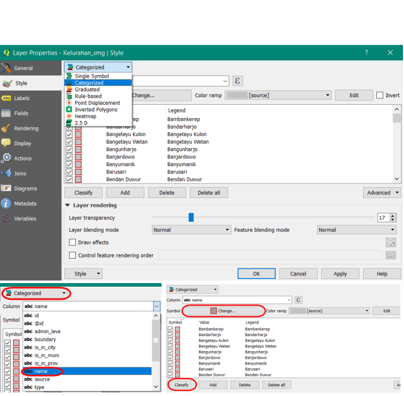
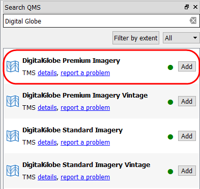
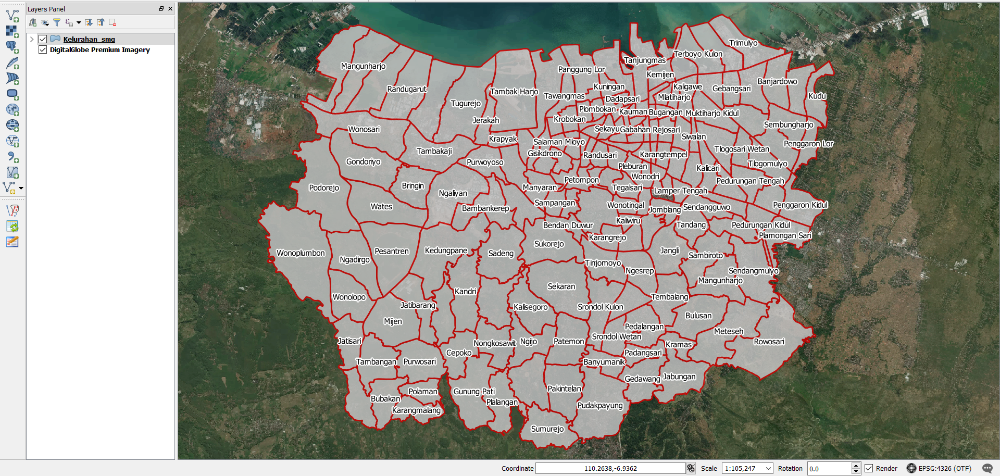
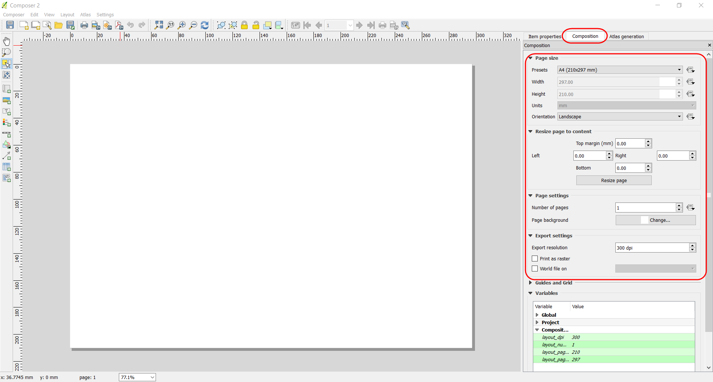
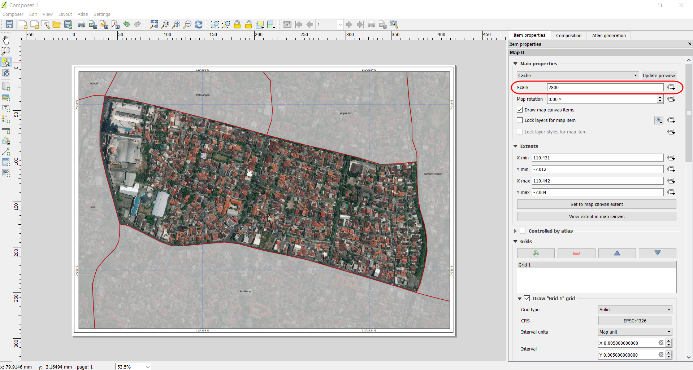
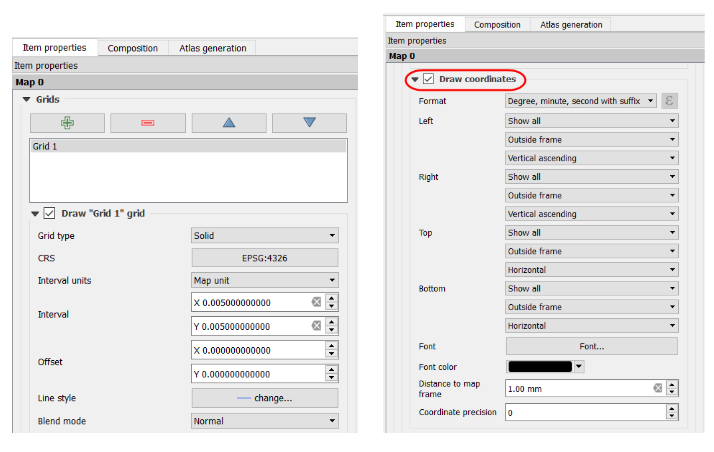
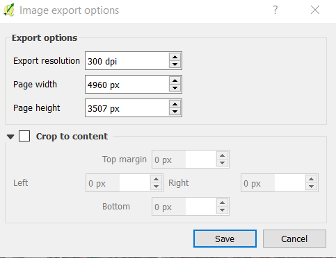

# **Pembuatan Peta Survei dengan Menggunakan QGIS**

**Tujuan Pembelajaran:**

*   Memahami cara instalasi QGIS pada komputer/laptop
*   Memahami cara mengoperasikan QGIS untuk memasang _plugin_
*   Memahami cara mengoperasikan QGIS untuk membuat peta survei

Peta survei digunakan untuk memudahkan _data entry_ dalam pengenalan dan identifikasi lokasi saat survei lapangan. Jika Anda ingin melakukan pemetaan batas administrasi, peta survei ini dapat juga digunakan untuk menggambarkan batas administrasi terbaru yang dihasilkan dari diskusi dengan pihak kelurahan atau pemerintahan yang mengetahui batas wilayah tersebut. Pembuatan peta akan dilakukan dengan menggunakan QGIS desktop versi 2.14.22. QGIS merupakan desktop yang gratis dan terbuka, dimana semua orang dapat men-_download_ secara gratis melalui situs https://qgis.org/.

### **I. *Download* dan Instal QGIS**

*   Jika Anda belum memiliki QGIS, maka Anda dapat men-_download_ instalasi melalui _web browser_ seperti Firefox atau Chrome.
*   Pada kolom halaman di atas jendela _browser_, masukan tautan berikut [http://qgis.org/](http://qgis.org/)
*   Tampilan utama QGIS akan tampak seperti gambar di bawah ini: 

*   Klik ***Download Now → All Releases →*** klik ***here*** pada *Older releases of QGIS are available* untuk mencari QGIS versi 2.14 atau Anda dapat klik tautan berikut : [http://download.osgeo.org/qgis/win64/QGIS-OSGeo4W-2.14.22-1-Setup-x86.exe](http://download.osgeo.org/qgis/win64/QGIS-OSGeo4W-2.14.22-1-Setup-x86.exe)untuk Windows 32 bit dan [http://download.osgeo.org/qgis/win64/QGIS-OSGeo4W-2.14.22-1-Setup-x86_64.exe](http://download.osgeo.org/qgis/win64/QGIS-OSGeo4W-2.14.22-1-Setup-x86_64.exe) untuk Windows 64 bit. 

*   Jika Anda tidak menggunakan Windows, pilih sistem operasi yang Anda butuhkan pada indeks QGIS.

*   Ketika _file_ instalasi telah selesai di _download_, jalankan dan ikuti instruksinya untuk menginstal QGIS. 

### **II. Instalasi _Plugin_ QuickMapServices pada QGIS**

Dalam pembuatan peta survei, Anda memerlukan _plugin_ yang akan membantu dalam menampilkan latar belakang peta untuk mengidentifikasi objek yang ada di lapangan. _Plugin_ yang digunakan yaitu _QuickMapServices_, Anda dapat men-_download_ secara gratis melalui QGIS _desktop_ dan memerlukan jaringan internet untuk men-_download_. Langkah-langkah dalam menginstal _plugin_, yaitu:

*   Buka **QGIS** dan pastikan laptop Anda sudah terhubung dengan koneksi internet. Klik **_Menu Plugins → Manage and Install Plugins_** 

   
*   Pada kolom **_Search_** ketikkan **_QuickMapServices_** kemudian **_Install Plugin_**

*   Jika proses instalasi _plugin_ sudah selesai, mari lanjutkan dengan proses pembuatan peta cetak.

### **III. Persiapan Data**

Dalam mempersiapkan data untuk pembuatan peta survei, data spasial yang diperlukan, yaitu batas administrasi. Jika Anda memiliki peta jaringan jalan yang dilengkapi dengan nama jalan dapat juga dipersiapkan dalam pembuatan peta untuk membantu dalam identifikasi lokasi di lapangan. 

Langkah - langkah dalam mempersiapkan data, yaitu : 

*   Masukkan batas administrasi dalam ke dalam **QGIS** dengan klik **_Add Vector Layer_**

*   Anda dapat melakukan **simbologi** dan **_labelling_** pada _layer_ tersebut.
*   Untuk melakukan simbologi, Anda dapat **klik kanan pada layer batas administrasi → _Properties → Style → Categorized._** Arahkan kursor ke **_Column_** → pilih nama kolom yang berisi nama kelurahan → _Classify_.  Jika ingin mengubah simbologi, pilih **_Symbol → Change_.**

*   Untuk pemberian label, **klik kanan pada layer batas administrasi → ***Properties → Labels → Show labels for this layer*** → pada kolom ***label with*** pilih kolom yang berisi **nama kelurahan**. Anda dapat mengatur format huruf di dalam menu ***Text***, mengatur penegasan huruf di dalam menu ***Buffer***, mengatur penempatan huruf di dalam Menu ***Placement***.

*   Jika sudah selesai, maka hasilnya seperti gambar di bawah ini

*   Untuk menampilkan latar belakang citra satelit secara _online_, klik **_Menu Web →  QuickMapServices → Search QMS_**. _Plugin_ akan tampil pada panel di sebelah kanan, Anda dapat mengetikkan nama citra satelit yang tersedia, misalnya **_DigitalGlobe Imagery_**. 

*   Pada kotak dialog akan tampak beberapa citra yang sesuai dengan nama tersebut, klik **_DigitalGlobe Premium Imagery_**. Tunggu beberapa saat sampai citra tersebut tampak pada _map canvas_ Anda. 

*   Simpan proyek peta Anda dengan klik **_Menu Project → Save_ → Beri nama proyek → _Save_**. Pemberian nama proyek QGIS, misalnya Peta Survei.

### **IV. Membuat Layout dengan Map Composer**

*   Untuk memulai pembuatan _layout_ peta, pertama-tama buat _composer_ baru di peta dengan klik Menu **_Project → New Print Composer_**. Kemudian akan muncul jendela _composer_ kosong.

*   Pada **_empty composer_**, pertama-tama lakukan pengaturan yang terkait dengan kertas yang akan digunakan seperti ukuran kertas, orientasi, margin dan resolusi ekspor. Pengaturan dapat dilakukan di bagian **_Composition_** pada panel sebelah kanan dari _composer_.

*   Tambahkan garis tepi untuk _layout_ berupa persegi dengan _tools_ **_Add shape_**, lalu klik, tahan dan geser untuk membuat bentuk persegi pada _map layout_. Anda bisa mengubah ketebalan dan warna garis pada ***Item Properties → Style → Change***. 

*   Tambahkan konten peta ke dalam _composer_ melalui _tools_ ***Add new map***, lalu klik, tahan dan geser untuk menambahkan peta baru. Pengaturan terkait peta yang baru ditambahkan terletak pada bagian ***Item Properties*** di sebelah kanan. Posisi dan skala konten peta dapat digeser dengan **_Move Item Content_**. Pindahkan isi peta untuk mengatur posisi dan gunakan _scroll_ untuk mengatur skala. Skala juga dapat diubah melalui **_Item Properties_**.

*   Tambahkan _grid_ peta melalui **_Item Properties → Grids →_ klik tanda + _→ Draw Grid_**. Lakukan pengaturan terhadap _grid_ seperti tipe **_grid_ dan interval**. Interval _grid_ akan mengacu pada satuan koordinat peta. Beri tanda centang pada **_Draw coordinate_** untuk menambahkan koordinat peta di setiap garis _grid_.

  
*   Tambahkan judul peta dengan klik _tools_ **_Add new label_** lalu klik _mouse_, tahan dan geser untuk menambahkan label pada **_composer_**. Satu objek label hanya dapat menggunakan satu format penulisan. Buat beberapa label jika menginginkan variasi format penulisan. Anda dapat klik **_Font_** untuk mengubah format penulisan, klik ***Horizontal alignment → Center*** untuk membuat tulisan berada di posisi tengah, dan klik **_Vertical alignment → Middle_** untuk membuat tulisan berada di posisi tengah secara tegak lurus.

*   Tambahkan arah mata angin melalui _tools_ **_Add Image → Item Properties → Search Directories_**. Kemudian buat kotak batasan yang menentukan lokasi dan ukuran gambar tersebut akan ditampilkan pada peta, lalu pilih gambar arah mata angin yang ingin ditambahkan ke dalam peta.

*   Tambahkan skala peta melalui _tools_ **_Add new scalebar_**. Untuk membuat skala angka, ubah **_Style_** pada **_Main Properties_** menjadi **_numeric_**. Jika Anda ingin menambahkan lebih dari satu tampilan skala, dapat ditambahkan kembali dengan klik _tools_ yang sama. Anda dapat melakukan pengaturan **_segments_** untuk mengatur jumlah baris pada skala baris.

*   Tambahkan sumber data dengan _tools_ **_Add new label_** Informasi sumber data dapat diisikan dengan “DigitalGlobe Premium Imagery ([www.digitalglobe.com](www.digitalglobe.com)) **© Digital Globe**” sebagai lisensi karena sudah menggunakannya sebagai latar belakang peta. 

*   Jika peta survei sudah selesai, maka Anda dapat mengekspor peta tersebut. Klik **_Export as Image_** untuk mengekspor peta ke dalam format jpg, png, pdf, dan svg. Anda dapat memilih pengaturan resolusi gambar dengan menambahkan angka pada **_Export resolutions_** agar hasil cetak semakin bagus, pengaturan awal untuk resolusi gambar di QGIS yaitu 300 dpi. Hasil peta dengan resolusi gambar  300 dpi sudah menghasilkan kualitas gambar/peta yang cukup bagus. Kemudian peta diekspor dalam bentuk gambar untuk memudahkan dalam pencetakan.

*   Setelah proses ekspor peta selesai, hasilnya akan menjadi seperti di bawah ini

  **RINGKASAN**

Jika Anda dapat mengikuti dan memperhatikan seluruh tahapan dalam bab ini, Anda sudah dapat membuat peta survei sederhana yang dapat dicetak sesuai dengan ukuran kertas pada peta dengan menggunakan QGIS. Kemudian peta tersebut dapat dibagikan dan dibawa oleh _data entry/surveyor_ ke lapangan.
